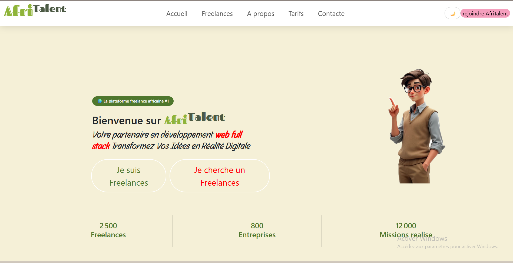
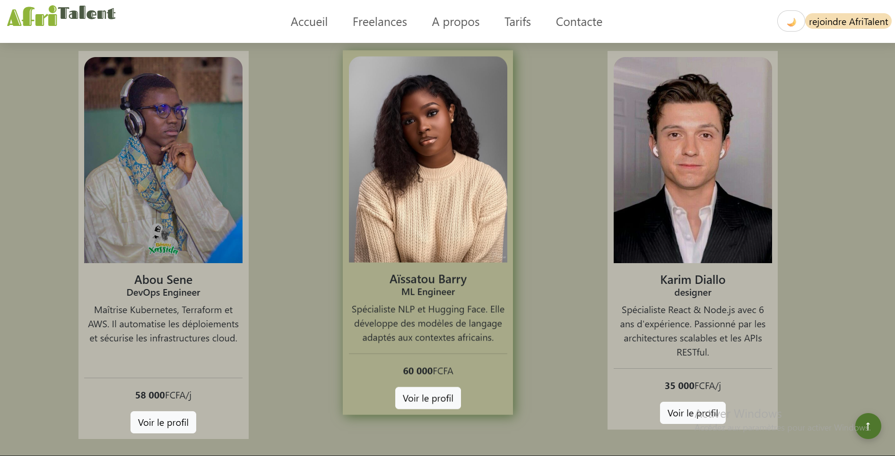

# AfriTalent 
Projet fil rouge — Plateforme de mise en relation entre freelances africains et 
clients. 
Auteur : Seydou abou Sene 
Promotion : L1 IAGE — ISI 
## lien du site en ligne
l' adresse https://seydouabousene.github.io/Seydouna-
## Aperçu du site

## 📄 Pages du site

| Page | Description |
| index.html | Page d'accueil — Hero, services, témoignages, CTA |
| freelances.html | Catalogue des freelances avec filtrage |
| about.html | Histoire, équipe, valeurs, chiffres clés |
| tarifs.html | Plans tarifaires et FAQ |
| contact.html | Formulaire de contact et carte Google Maps |

---

##  Technologies utilisées

| Technologie | Utilisation |
| HTML5 | Structure des pages |
| CSS3 | Styles et animations |
| Bootstrap 5 | Grille responsive et composants |
| JavaScript | Interactions et dynamisme |
| Font Awesome | Icônes |
| Google Maps | Carte intégrée page contact |

---

##  Fonctionnalités

-  Design responsive (mobile, tablette, desktop)
-  Dark mode avec sauvegarde localStorage
-  Navbar fixe avec effet au scroll
-  Animations fade-in au scroll (IntersectionObserver)
-  Compteurs animés sur les statistiques
-  Carousel de témoignages Bootstrap
-  Filtrage dynamique des freelances (sans rechargement)
-  Validation complète du formulaire de contact
-  Bouton retour en haut
-  Bento Grid asymétrique
